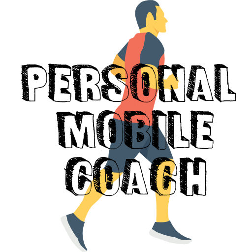

# Personal Mobile Coach

This project was done under the Haute école d'ingénierie et de gestion du canton de Vaud.

## Preview

## The project :

   * Manually trained model is converted and put locally into the app. 

   * The model is based on a specific personalized dataset (of a runner)   

   * The user starts the app and lays out his path on the map. 

   * Then, the user starts the run. Once the user has run far enough to collect the necessary data, the model in the app will start its prediction. 

   * Data is continuously captured during the whole run. 

   * This prediction is the expected arrival time of the runner. The result of this estimation will be displayed on the app. 

   * The model is asked every so often in the race to compute again the expected arrival time from the new current time data points.
   
   * Note that the model is optimized for real-time prediction over short distance but the this system is not done so is currently replaced by the arrival time prediction. (Thats why the prediction my take a while)
   
  
## Usefull commands :  
   
   `npm install`
   
   `npx react-native start`
   
   `npx react-native run-android`
   
if problem with watchman:

  `echo 999999 | sudo tee -a /proc/sys/fs/inotify/max_user_watches && echo 999999 | sudo tee -a /proc/sys/fs/inotify/max_queued_events && echo 999999 | sudo tee -a /proc/sys/fs/inotify/max_user_instances && watchman shutdown-server`

To convert keras/tensorflow model for the app:

`tensorflowjs_converter --input_format=tf_saved_model --output_format=tfjs_graph_model --weight_shard_size_bytes 60000000 some/path/to/model /home/hadrien/Bureaupath/to/put/output`
   
